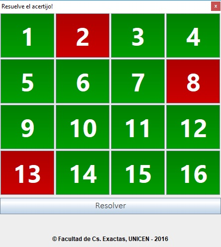

# Funny Puzzle

El juego consiste de un tablero de 4x4 con cada casilla pintada de color rojo o blanco.
Al presionar una de las casillas, la casilla presionada y las vecinas cambiaran de color. 

El objetivo del juego es conseguir que el tablero completo quede de color verde.
Todos los tableros tienen una posible solucion, y puede ser consultada en cualquier momento presionando el boton **Resolver**

Funny Puzzle es una aplicacion de escritorio programada en Java. 

## Desarrollo

El objetivo es mostrar a alumnos de secundaria el poder de las computadoras para resolver problemas lógicos, a veces en menor tiempo de lo que lo hace un ser humano.

Esta aplicacion fue desarrollada para el proyecto de Vocaciones TIC llevado a cabo en 2016 por la UNCPBA
